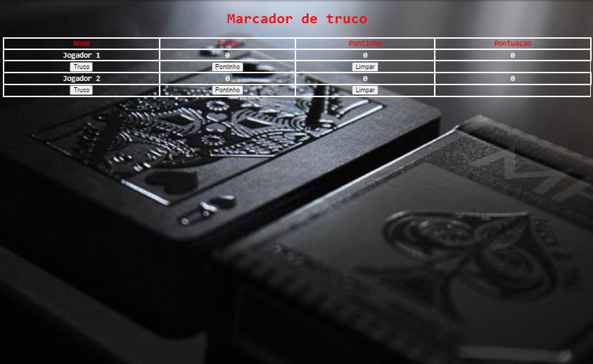

## 💻 Marcador de Truco
Marcador para jogar com amigos e competiçoes.🔖

## 💡 Funcionalidades

- Marcar Truco, Pontinho e Limpar placar.
- Somando pontuaçao Truco(3pts), Pontinho(1pts).

 

## 🔗 Criado em CodePen 

Copyright (c) 2021 by Amadeu Filipe Lopes (https://codepen.io/felipelopes12/pen/eYgdLyX)

